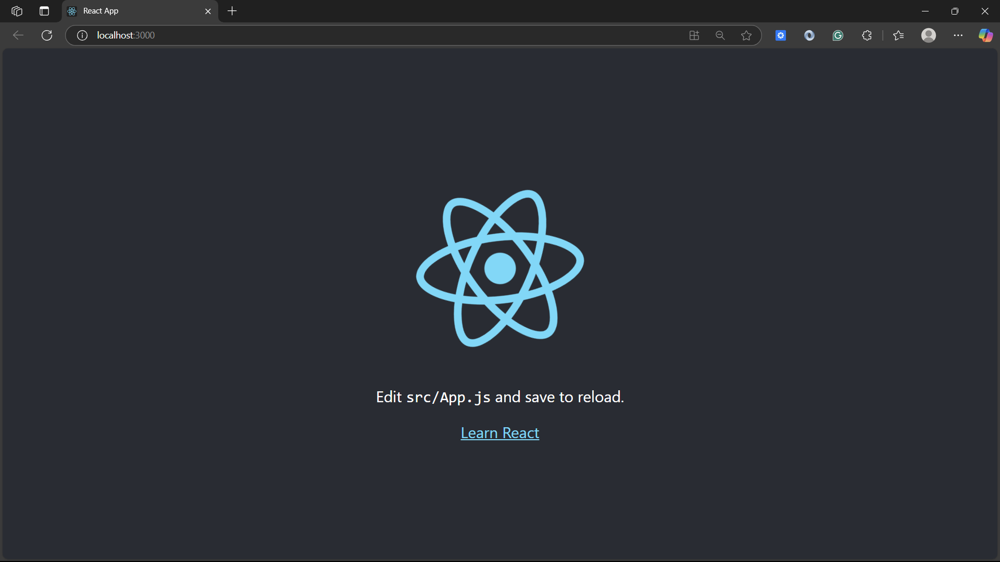

# Getting Started with Create React App

This project was bootstrapped with [Create React App](https://github.com/facebook/create-react-app).

## Available Scripts

In the project directory, you can run:

### `npm start`

Runs the app in the development mode.\
Open [http://localhost:3000](http://localhost:3000) to view it in your browser.

The page will reload when you make changes.\
You may also see any lint errors in the console.

### `npm test`

Launches the test runner in the interactive watch mode.\
See the section about [running tests](https://facebook.github.io/create-react-app/docs/running-tests) for more information.

### `npm run build`

Builds the app for production to the `build` folder.\
It correctly bundles React in production mode and optimizes the build for the best performance.

The build is minified and the filenames include the hashes.\
Your app is ready to be deployed!

See the section about [deployment](https://facebook.github.io/create-react-app/docs/deployment) for more information.

### `npm run eject`

**Note: this is a one-way operation. Once you `eject`, you can't go back!**

If you aren't satisfied with the build tool and configuration choices, you can `eject` at any time. This command will remove the single build dependency from your project.

Instead, it will copy all the configuration files and the transitive dependencies (webpack, Babel, ESLint, etc) right into your project so you have full control over them. All of the commands except `eject` will still work, but they will point to the copied scripts so you can tweak them. At this point you're on your own.

You don't have to ever use `eject`. The curated feature set is suitable for small and middle deployments, and you shouldn't feel obligated to use this feature. However we understand that this tool wouldn't be useful if you couldn't customize it when you are ready for it.

## Learn More

You can learn more in the [Create React App documentation](https://facebook.github.io/create-react-app/docs/getting-started).

To learn React, check out the [React documentation](https://reactjs.org/).

### Code Splitting

This section has moved here: [https://facebook.github.io/create-react-app/docs/code-splitting](https://facebook.github.io/create-react-app/docs/code-splitting)

### Analyzing the Bundle Size

This section has moved here: [https://facebook.github.io/create-react-app/docs/analyzing-the-bundle-size](https://facebook.github.io/create-react-app/docs/analyzing-the-bundle-size)

### Making a Progressive Web App

This section has moved here: [https://facebook.github.io/create-react-app/docs/making-a-progressive-web-app](https://facebook.github.io/create-react-app/docs/making-a-progressive-web-app)

### Advanced Configuration

This section has moved here: [https://facebook.github.io/create-react-app/docs/advanced-configuration](https://facebook.github.io/create-react-app/docs/advanced-configuration)

### Deployment

This section has moved here: [https://facebook.github.io/create-react-app/docs/deployment](https://facebook.github.io/create-react-app/docs/deployment)

### `npm run build` fails to minify

This section has moved here: [https://facebook.github.io/create-react-app/docs/troubleshooting#npm-run-build-fails-to-minify](https://facebook.github.io/create-react-app/docs/troubleshooting#npm-run-build-fails-to-minify)

# **Laporan Praktikum**

|  | Pemrograman Berbasis Framework 2025 |
|--|--|
| NIM |  2241720223|
| Nama |  Sukma Bagus Wahasdwika |
| Kelas | TI - 3D | 

## **Langkah-langkah Praktikum**
### Praktikum 1 : Persiapan Lingkungan
1. Pastikan Node.js dan npm sudah terinstal di komputer Anda. Anda dapat memeriksanya dengan
menjalankan perintah berikut di terminal atau command prompt:

    

2.  Buat direktori baru untuk proyek React Anda:

    
    
3.  Inisialisasi proyek React dengan menjalankan perintah berikut:

    
    
4.  Jalankan aplikasi React dengan perintah:

    

    

### Praktikum 2 : Membuat Komponen React
1. Buka file src/App.js di text editor Anda.
2. Ganti kode di dalamnya dengan kode berikut untuk membuat komponen sederhana:

    

3. Simpan file dan lihat perubahan di browser. Anda akan melihat tampilan sederhana dengan
header, konten utama, dan footer.

    

### Praktikum 3 : Menggunakan JSX untuk Membuat Komponen Dinamis
1.  Buat file baru di direktori src dengan nama Counter.js.
2.  Tambahkan kode berikut untuk membuat komponen Counter yang dinamis:

    
    
3.  Buka file src/App.js dan impor komponen Counter:

    

4.  Tambahkan komponen Counter ke dalam komponen App:

    

5.  Simpan file dan lihat perubahan di browser. Anda akan melihat tombol "Tambah" yang dapat
meningkatkan hitungan saat diklik.

    

### Praktikum 4 : Menggunakan Props untuk Mengirim Data
1. Buat file baru di direktori src dengan nama Greeting.js.
2. Tambahkan kode berikut untuk membuat komponen Greeting yang menerima props:

    

3. Buka file src/App.js dan impor komponen Greeting:

    

4. Tambahkan komponen Greeting ke dalam komponen App dan kirim props name:

    

5. Simpan file dan lihat perubahan di browser. Anda akan melihat pesan "Halo, John!" yang
ditampilkan oleh komponen Greeting.

    

### Praktikum 5 : Menggunakan State untuk Mengelola Data
1. Buka file src/App.js dan tambahkan kode berikut untuk membuat komponen yang mengelola
state:

    

2. Tambahkan komponen Example ke dalam komponen App:

    

3. Simpan file dan lihat perubahan di browser. Anda akan melihat form input yang dapat
mengupdate state dan menampilkan data yang dimasukkan.

    

### Tugas
